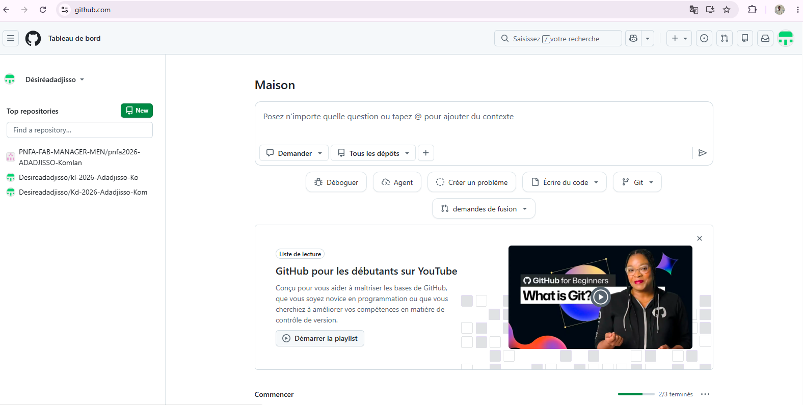

# Journal du 25 Août 2026 (rédigé par ADADJISSO Komlan)
## Fait aujourd'huit
-Nous avons commencé la journée en revenant sur la manière de bien documenter notre travail.

-Ensuite, nous avons appris comment relier VS Code à notre compte GitHub.

-Nous avons également créé différents groupes pour assurer la continuité de la formation.

## Appris
J’ai appris à créer un dépôt sur GitHub et à effectuer des modifications sur celui-ci.
## Raté
- Je n’ai pas pu terminer mon dépôt. En raison de l’absence du mail d’invitation, je n’ai pas pu finaliser mon dépôt, ce qui m’a empêché de bien maîtriser tout le processus.
## Décidé
-Il a été décidé que le mail d’invitation nous sera envoyé demain et que nous serons accompagnés afin de terminer nos dépôts.

-Désormais, nous allons travailler en groupes de quatre ou cinq personnes.
## A fair demain
-Après avoir reçu les mails d’invitation, nous allons terminer nos dépôts. Désiré

-Nous allons également apprendre à créer et à gérer des dépôts en groupe. Désiré